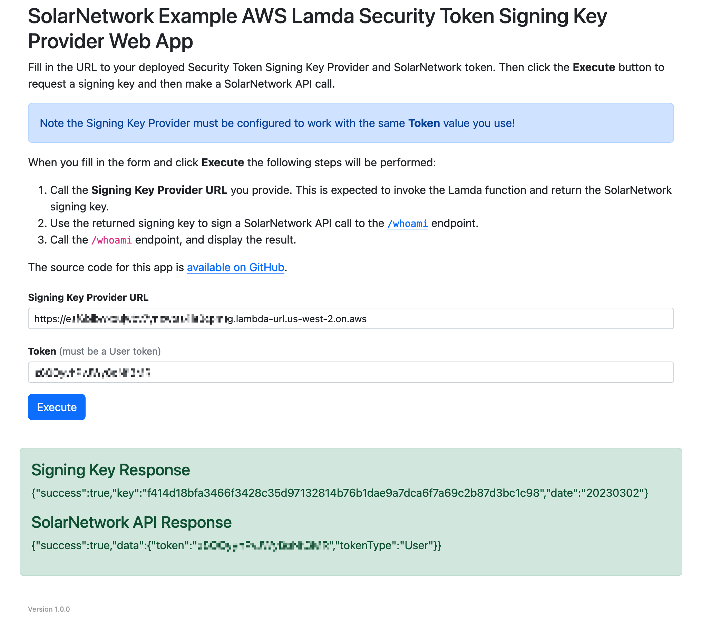

# SolarNetwork Example AWS Lamda Security Token Signing Key Provider Web App

This project contains a webapp that demonstrates working with the
[AWS Lamda Security Token Signing Key Provider](../README.md) in this repository.



# Use

Fill in the URL to your deployed AWS Lamda Security Token Signing Key Provider function and
the token the function can provide a signing key for, then click the **Execute** button to test
the authentication process out.

# Building

The build uses [NPM][npm] or [Yarn][yarn]. First, initialize the dependencies:

```shell
# NPM
npm install

# or, Yarn
yarn install
```

Then, the development web server can be started via

```shell
# NPM
npm run start

# or, Yarn
yarn run start
```

and then the app can be reached at [localhost:9000](http://localhost:9000). For a
produciton build, use

```shell
# NPM
npm run build -- --config webpack.prod.js

# or, Yarn
yarn run build --config webpack.prod.js
```

and the app will be built in the `dist` directory.

[npm]: https://www.npmjs.com/
[yarn]: https://yarnpkg.com/
